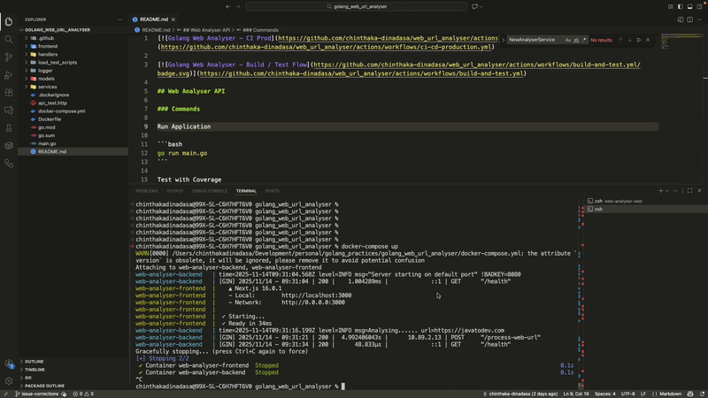

[](https://github.com/chinthaka-dinadasa/web_url_analyser/actions/workflows/backend-ci-cd-production.yml)

[](https://github.com/chinthaka-dinadasa/web_url_analyser/actions/workflows/frontend-ci-cd-production.yml)

## Web Analyser API

### Project overview

This source code includes simple web url analyser which analyse incoming URL. Backend API was developed using Golang and frontend is developed with Next JS.

## External Dependencies

- Gin [https://gin-gonic.com/](https://gin-gonic.com/)
- goquery [https://github.com/PuerkitoBio/goquery](https://github.com/PuerkitoBio/goquery)



### How to run the application - API

Clone the Repo

Environment Variables

```bash
PORT=8080
MAX_WORKERS=50
CACHE_TTL=1 //Hours
```

```bash
go run main.go
```

### How to run the application - Next JS UI

Navigate to frontend/web-analyser-web - Node.js version ">=20.9.0" is required

Environment variables

```
NEXT_PUBLIC_APP_API_URL=http://localhost:8080/process-web-url
```

```bash
npm install
npm run dev
```

### How to run the application - Using Docker Compose

```bash
docker-compose build
docker-compose up 
```

### Test Golang Code with Coverage

```bash
go test -cover -v ./...
```

### Application main components

- Logging - Setup was done using slog
- Cors - Gin Cors
- HTTP - Gin
- Load testing - k6

### Challenges

Most of the websites block application when running tests with urls. (Eg:- Facebook )
Url accessibility check getting longer time since it should check one by one with real responses. this getting application bit slower to respond.